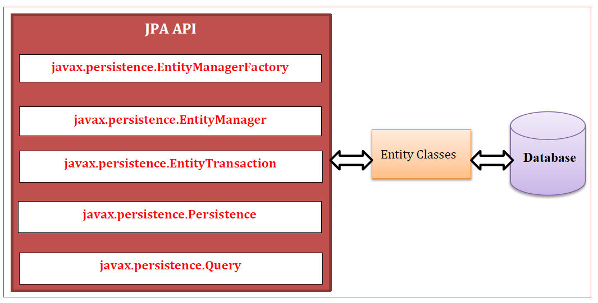
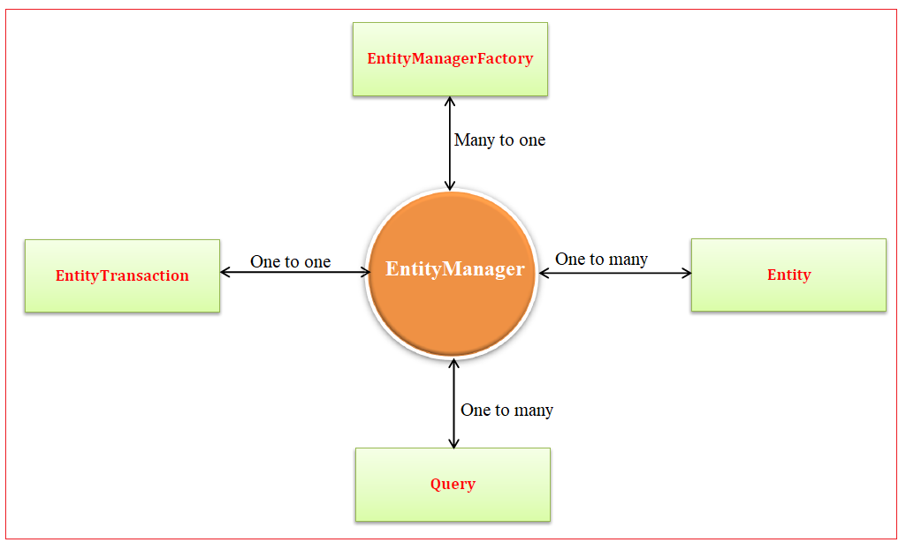

# 📦 JPA 아키텍처 완전 정복: 핵심 구성요소부터 내부 구조까지

> JPA(Java Persistence API)는 자바 객체와 관계형 데이터베이스를 연결해주는 표준 ORM(Object-Relational Mapping) 스펙입니다. 이번 챕터에서는 JPA의 전체 아키텍처 구조를 시각적으로 이해하고, 각 구성 요소가 어떤 역할을 수행하는지 알아보겠습니다.

---

## 🧱 1. JPA 전체 아키텍처 구성
<br>

JPA의 아키텍처는 아래와 같은 핵심 구성 요소로 이루어져 있습니다:

* `persistence.xml` (설정 파일)
* `EntityManagerFactory`
* `EntityManager`
* `Persistence Unit`
* `Entity (Persistent Class)`
* `Persistence Context`
* `Query`, `Transaction`

### 📌 핵심 아키텍처 흐름

1. `persistence.xml`에서 Persistence Unit을 정의
2. `EntityManagerFactory`가 설정을 읽어 생성됨 (JDBC 커넥션 풀 관리 포함)
3. 트랜잭션마다 새로운 `EntityManager` 생성
4. `EntityManager`는 엔티티에 대해 CRUD 작업 수행
5. `Persistence Context`는 영속 상태(Entity 객체)를 관리

---

## 🔧 2. `persistence.xml` 예제

```xml
<persistence xmlns="http://java.sun.com/xml/ns/persistence" version="2.0">
  <persistence-unit name="myUnit">
    <provider>org.hibernate.ejb.HibernatePersistence</provider>
    <class>com.example.entity.Student</class>
    <properties>
      <property name="javax.persistence.jdbc.url" value="jdbc:mysql://localhost:3306/jpadb"/>
      <property name="javax.persistence.jdbc.user" value="root"/>
      <property name="javax.persistence.jdbc.password" value="password"/>
      <property name="javax.persistence.jdbc.driver" value="com.mysql.cj.jdbc.Driver"/>
    </properties>
  </persistence-unit>
</persistence>
```

* `persistence-unit` 태그는 JPA의 기본 단위이며, 이를 기준으로 `EntityManagerFactory`가 설정됨
* `provider`는 Hibernate 구현체 지정

---

## 🏗️ 3. JPA 클래스별 구조 및 역할
<br>


### 📌 EntityManagerFactory

* `persistence.xml`을 읽어 생성
* **스레드 안전 (thread-safe)**
* **JDBC 커넥션 풀 관리**
* 하나만 생성되어 **여러 `EntityManager`를 생성하는 팩토리 역할**

### 📌 EntityManager

* 하나의 트랜잭션에 대해 하나씩 생성
* CRUD, JPQL, 트랜잭션 제어 수행
* **스레드 안전하지 않음** → 트랜잭션마다 별도 인스턴스 생성 권장

### 📌 Persistence Unit

* `persistence.xml` 내부에 정의
* 이 유닛 안에서 관리되는 모든 Entity 클래스 집합을 의미

### 📌 Entity Class (Persistent Class)

* DB 테이블을 매핑하는 POJO 클래스
* `@Entity` 어노테이션으로 지정
* 각 인스턴스가 하나의 DB 레코드(행)를 의미

```java
@Entity
public class Student {
  @Id
  private Long id;
  private String name;
  private int score;
}
```

---

## 🔄 4. EntityManager와 다른 구성 요소의 관계

| 관계                                       | 설명                                 |
| ---------------------------------------- | ---------------------------------- |
| `EntityManagerFactory` ↔ `EntityManager` | **1\:N** 관계: 하나의 팩토리에서 여러 매니저 생성   |
| `EntityManager` ↔ `EntityTransaction`    | **1:1** 관계: 한 트랜잭션은 하나의 매니저가 관리    |
| `EntityManager` ↔ `Query`                | **1\:N** 관계: 하나의 매니저가 여러 쿼리를 실행 가능 |
| `EntityManager` ↔ `Entity`               | **1\:N** 관계: 하나의 매니저가 여러 엔티티 관리 가능 |

---

## 🧠 5. JPA의 영속성 컨텍스트 (Persistence Context)
<br>

* `EntityManager`에 의해 관리되는 **1차 캐시 공간**
* **엔티티 객체들은 Persistence Context 내부에서 영속 상태로 존재**
* 변경 추적(Dirty Checking), 지연 로딩(Lazy Loading) 등의 기능 수행

---

## 🔎 6. JPA Query

* JPA는 `javax.persistence.Query`를 통해 객체 지향 쿼리인 **JPQL(Java Persistence Query Language)** 사용
* SQL과 유사하지만 **엔티티 객체와 필드 기준으로 작성**

```java
Query query = entityManager.createQuery("SELECT s FROM Student s WHERE s.score > 90");
List<Student> results = query.getResultList();
```

---

## 🚨 7. JPA 예외 처리 구조

JPA의 예외는 모두 **Unchecked Exception**으로 분류됩니다. 즉, 컴파일 시 강제 처리가 요구되지 않으며 런타임에 발생합니다.

| 예외                         | 설명                    |
| -------------------------- | --------------------- |
| `IllegalArgumentException` | 잘못된 아규먼트 전달           |
| `IllegalStateException`    | 부적절한 상태에서의 호출         |
| `PersistenceException`     | JPA 전반에서 발생 가능한 기본 예외 |
| `RollbackException`        | 트랜잭션 롤백 실패            |

---

## 📌 정리

| 구성 요소                  | 주요 역할                              |
| ---------------------- | ---------------------------------- |
| `persistence.xml`      | JPA 설정 정보 정의                       |
| `EntityManagerFactory` | 스레드 안전, 커넥션 풀 관리, EntityManager 생성 |
| `EntityManager`        | 트랜잭션 별로 생성, CRUD 및 쿼리 수행           |
| `Persistence Context`  | 엔티티 상태 추적 및 관리 (1차 캐시)             |
| `Entity`               | POJO 클래스, DB 테이블 매핑                |
| `Query`                | JPQL 기반 쿼리 실행                      |
| `Transaction`          | `EntityManager`를 통해 제어             |


